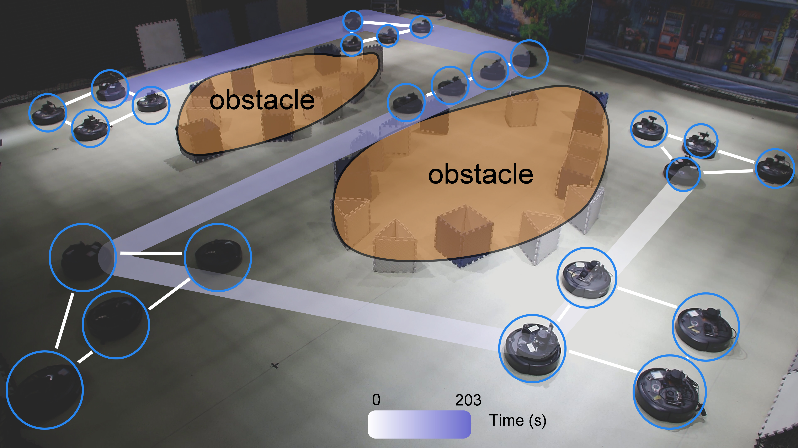
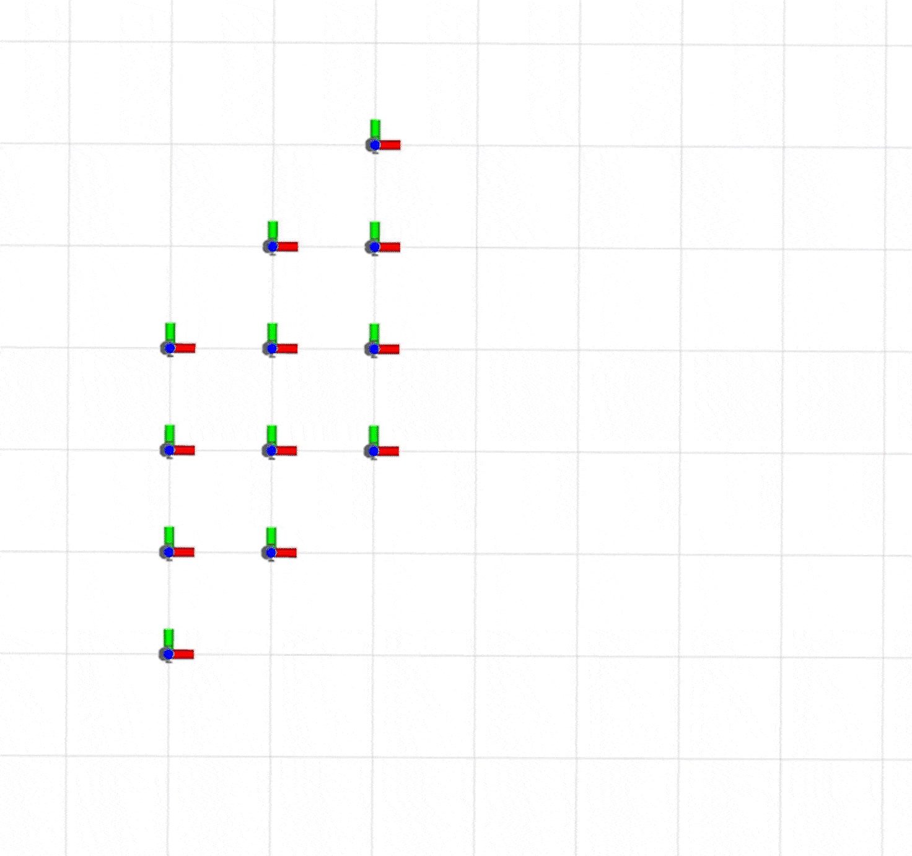

# DEFORM

Adaptive Formation Reconfiguration of Multi-robot System in Confined Environments

<div align="center">
    
</div>

## Table of Contents

1. <a href="#1-Introduction">Introduction</a>
2. [Prerequisites](#2-Prerequisites)
3. [Build DEFORM on ROS](#3-Build-DEFORM-on-ROS)
4. [Demo](#4-Demo)
5. [Docker Support](#5-Docker-Support)
6. [Citation](#6-Citation)
7. [Acknowlegements](#7-Acknowlegements)

## 1 Introduction

DEFORM is an adaptive formation reconfiguration method that can autonomously adjust its formation based on environmental information.

### 1.1 Related Video

Our accompanying video is now available on [**Bilibili**](https://www.bilibili.com/video/BV1ptEEzQEHm) and [**YouTube**](https://youtu.be/Gp7ctSpoegI).

### 1.2 Related paper

Jin Li, Yang Xu, Xiufang Shi, Liang Li, **"DEFORM: Adaptive Formation Reconfiguration of Multi-robot System in Confined Environments"**, In *IEEE Robotics and Automation Letters(RA-L)*, 2025. [IEEE](https://ieeexplore.ieee.org/document/10933518), [Paper](./RA_L_DEFORM.pdf)

## 2 Prerequisites

2.1 **Ubuntu** and **ROS**: Ubuntu 20.04. ROS Noteic. ROS Installation additional ROS package:

```
sudo apt install ros-noetic-turtlebot3-msgs
```

2.2 [**CasADi**](https://web.casadi.org/) Solver use version 3.7 and follows the installation steps below:

```shell
sudo apt update
sudo apt install build-essential coinor-libipopt-dev swig
sudo apt install gfortran liblapack-dev pkg-config --install-recommends
git clone https://github.com/casadi/casadi.git 
cd casadi
mkdir build && cd build 
cmake -DWITH_PYTHON=ON -DWITH_IPOPT=ON -DWITH_OPENMP=ON -DWITH_THREAD=ON ..
make 
sudo make install
cd ../..
rm -rf casadi/
sudo ldconfig
```

2.3 [**POT**](https://pythonot.github.io/#installation) use version 0.9.3 and follows the installation steps below:

```shell
sudo apt install python3-pip
pip3 install scipy numpy
pip3 install POT
```

## 3 Build DEFORM on ROS

Clone the repository and catkin_make

```shell
git clone https://github.com/NeSC-IV/DEFORM.git
cd DEFORM
catkin_make
source /opt/ros/noetic/setup.bash
source ./devel/setup.bash
```


## 4 Demo

### 4.1 Rapid formation convergence

<div align="center">
    
</div>

4.1.1 Fast formation convergence will be demonstrated. **First, you need to set `task_type` to 2 in [frm_shape.yaml](./src/plan_manager/config/frm_shape.yaml).** The other detailed steps are as follows:

```shell
# launch one terminal
# STEP 1:
cd DEFORM # The location where this repository is cloned, e.g: ~/DEFORM
source /opt/ros/noetic/setup.bash
source ./devel/setup.bash
roslaunch plan_manager multi_robots_simulation_deform.launch

# launch another terminal
# STEP 2:
cd DEFORM # The location where this repository is cloned, e.g: ~/DEFORM
source /opt/ros/noetic/setup.bash
source ./devel/setup.bash
roslaunch plan_manager multi_run.launch

# STEP 3: In the launched RViz, use 2D Nav Goal to publish the /move_base_simple/goal topic to start the program.
```

4.1.2 (**optional**) If you want to modify the initial and desired formation shaps, you can do so by configuring the settings file. The detailed steps are as follows:

- Modify the configuration file [frm_shape.yaml](./src/plan_manager/config/frm_shape.yaml): you can set the initial positions of the robots by modifying the `vehicle_pos_*` fields under `initial_shape_positions`, and set the desired formation by modifying the `vehicle_pos_*` fields under `desired_shape_positions`.

- Regenerate the launch file [multi_robots_simulation_deform.launch](./src/plan_manager/launch/multi_robots_simulation_deform.launch): it can be automatically generated by running the following script.

```shell
# launch one terminal
cd DEFORM # The location where this repository is cloned, e.g: ~/DEFORM
source /opt/ros/noetic/setup.bash
source ./devel/setup.bash
rosrun plan_manager generate_custom_init_pos_simulation.py
```

- Finally, restart `multi_robots_simulation_deform.launch` and `multi_run.launch` to observe the convergence of the new formation.

### 4.2 Formation navigation in multi-obstacle environment

<div align="center">
    
</div>

Formation navigation will be demonstrated. **First, you need to set `task_type` to 1 in [frm_shape.yaml](./src/plan_manager/config/frm_shape.yaml).** The other detailed steps are as follows:

```shell
# launch one terminal
# STEP 1:
cd DEFORM # The location where this repository is cloned, e.g: ~/DEFORM
source /opt/ros/noetic/setup.bash
source ./devel/setup.bash
roslaunch plan_manager multi_robots_simulation_navigation.launch

# launch another terminal
# STEP 2:
cd DEFORM # The location where this repository is cloned, e.g: ~/DEFORM
source /opt/ros/noetic/setup.bash
source ./devel/setup.bash
roslaunch plan_manager multi_run.launch

# STEP 3: In the launched RViz, use 2D Nav Goal to publish the /move_base_simple/goal topic to set an appropriate goal point in front of robots, such as (-20, 0).
```

## 5 Docker Support

[**rocker**](https://github.com/osrf/rocker) is a tools which will help you run **docker** containers with hardware acceleration. To run with rocker, first make sure [docker](https://docs.docker.com/install/linux/docker-ce/ubuntu/) are installed on your machine. 

5.1 Build a container using a Dockerfile.

```
cd DEFORM
docker build -t deform:v1 .
```

5.2 Start a container.

```
rocker --x11 --user --home --git --name deform_runtime deform:v1
```

5.3 (optional) Attach to the container named **deform_runtime**.

```
dokcer exec -it deform_runtime bash
```

5.4 Run different commands in different windows, refer to [Demo](#4-Demo) for details.

## 6 Citation

If our repo helps your academic projects, please cite our paper. Thank you!

```latex
@article{Jin2025DEFORM,
    title={DEFORM: Adaptive Formation Reconfiguration of Multi-robot System in Confined Environments}, 
    author={Jin, Li and Yang, Xu and Xiufang, Shi and Liang, Li}, 
    journal={IEEE Robotics and Automation Letters}, 
    year={2025}, 
    volume={10}, 
    number={5}, 
    pages={4706-4713}, 
    doi={10.1109/LRA.2025.3552998}
}
```

## 7 Acknowlegements

我们有一部分功能包是用开源代码实现的：

- [plan_env2d](./src/perception/plan_env2d/): https://github.com/ZJU-FAST-Lab/Swarm-Formation/tree/main/src/planner/plan_env
- [path_searching2d](./src/planning/path_searching2d): https://github.com/ZJU-FAST-Lab/Swarm-Formation/tree/main/src/planner/path_searching
- [drone_detect](./src/perception/drone_detect): https://github.com/ZJU-FAST-Lab/EGO-Planner-v2/tree/main/swarm-playground/formation_ws/src/planner/drone_detect

[Return to TOC](#Table-of-Contents)
